# 👔 코디 추천 & 컨텍스트 인식 시스템 기술 문서

> CloszIT RAG 기반 코디 추천, 날씨/캘린더 연동 시스템의 기술적 구현 상세 문서

## 📌 목차

1. [전체 아키텍처](#1-전체-아키텍처)
2. [RAG 기반 코디 추천](#2-rag-기반-코디-추천)
3. [벡터 검색 시스템 (pgvector)](#3-벡터-검색-시스템-pgvector)
4. [스코어링 시스템](#4-스코어링-시스템)
5. [날씨 서비스](#5-날씨-서비스)
6. [캘린더 연동](#6-캘린더-연동)
7. [피드백 시스템](#7-피드백-시스템)
8. [데이터베이스 설계](#8-데이터베이스-설계)
9. [API 설계](#9-api-설계)
10. [면접 예상 질문](#10-면접-예상-질문)

---

## 1. 전체 아키텍처

### 1.1 시스템 구성도

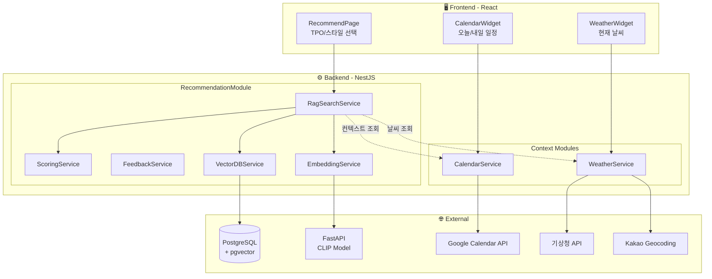

### 1.2 기술 스택

| 레이어 | 기술 | 용도 |
|--------|------|------|
| Backend | NestJS, Prisma | REST API, ORM |
| Vector DB | PostgreSQL + pgvector | 벡터 유사도 검색 |
| Embedding | CLIP (via FastAPI) | 텍스트 → 벡터 변환 |
| AI | AWS Bedrock (Claude) | TPO 추출, 분석 |
| Weather | 기상청 단기예보 API | 날씨 정보 |
| Geocoding | Kakao Local API | 주소 → 좌표 변환 |
| Calendar | Google Calendar API | 일정 조회 |

### 1.3 주요 파일 구조

```
closzIT-back/src/
├── recommendation/
│   ├── recommendation.module.ts
│   ├── recommendation.controller.ts
│   ├── services/
│   │   ├── rag-search.service.ts      # RAG 검색 핵심
│   │   ├── vector-db.service.ts       # pgvector 연동
│   │   ├── embedding.service.ts       # CLIP 임베딩
│   │   ├── scoring.service.ts         # 조합 스코어링
│   │   └── feedback.service.ts        # 피드백 처리
│   └── types/clothing.types.ts
├── weather/
│   ├── weather.service.ts             # 기상청 API 연동
│   └── weather.types.ts
└── calendar/
    └── calendar.service.ts            # Google Calendar 연동
```

---

## 2. RAG 기반 코디 추천

### 2.1 RAG 파이프라인 개요

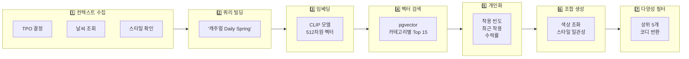

### 2.2 컨텍스트 우선순위

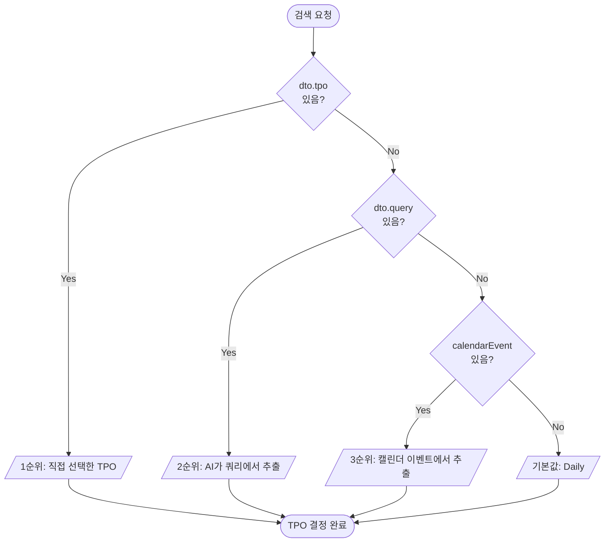

### 2.3 쿼리 빌딩 코드

```typescript
// rag-search.service.ts

private buildQueryText(context: SearchContext, preference: UserPreference): string {
  const parts: string[] = [];

  if (context.query) parts.push(context.query);           // 1. 사용자 쿼리
  if (context.style) parts.push(context.style);           // 2. 선택 스타일
  parts.push(context.tpo);                                 // 3. TPO (필수)
  parts.push(this.getSeasonFromTemp(context.weather?.temp)); // 4. 계절

  if (context.weather?.rain_probability > 50) {
    parts.push('비');                                      // 5. 비 올 확률
  }

  if (!context.style && preference.preferred_styles?.length > 0) {
    parts.push(...preference.preferred_styles);            // 6. 선호 스타일
  }

  return parts.join(' ');  // "캐주얼 Daily Spring"
}
```

### 2.4 온도 → 계절 매핑

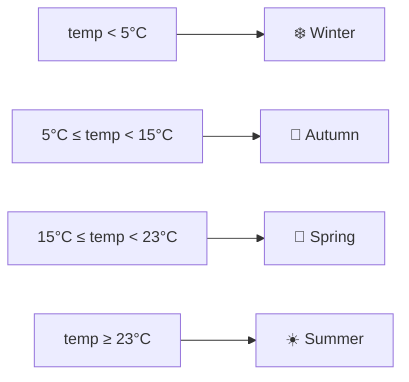

---

## 3. 벡터 검색 시스템 (pgvector)

### 3.1 pgvector 동작 원리

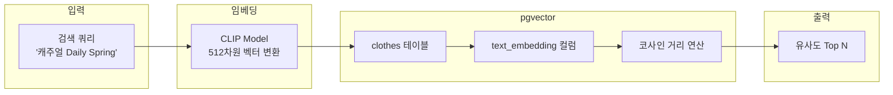

### 3.2 벡터 유사도 검색 쿼리

```typescript
async searchSimilar(userId: string, queryEmbedding: number[], options) {
  const vectorStr = `[${queryEmbedding.join(',')}]`;

  let query = `
    SELECT 
      id, image_url, category, colors, style_mood,
      wear_count, accept_count, reject_count,
      1 - (text_embedding <=> $1::vector) as score  -- 코사인 유사도
    FROM clothes
    WHERE user_id = $2 AND text_embedding IS NOT NULL
  `;

  // 동적 필터 추가
  if (options.category) query += ` AND category = $3::"Category"`;
  if (options.tpo) query += ` AND $4::"TPO" = ANY(tpos)`;
  
  query += ` ORDER BY text_embedding <=> $1::vector LIMIT $5`;

  return this.prisma.$queryRawUnsafe(query, ...params);
}
```

### 3.3 벡터 연산자 비교

| 연산자 | 이름 | 설명 | 사용 케이스 |
|--------|------|------|-------------|
| `<=>` | 코사인 거리 | 0~2 (0=동일) | ✅ **패션 유사성** |
| `<->` | 유클리드 거리 | 절대적 거리 | 위치 기반 검색 |
| `<#>` | 내적 | 정규화 시 코사인과 동일 | 정규화된 벡터 |

---

## 4. 스코어링 시스템

### 4.1 개인화 스코어링

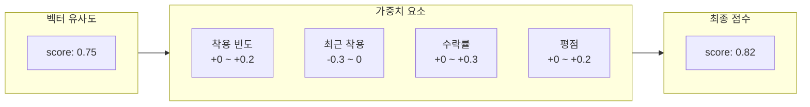

### 4.2 조합 스코어링 공식

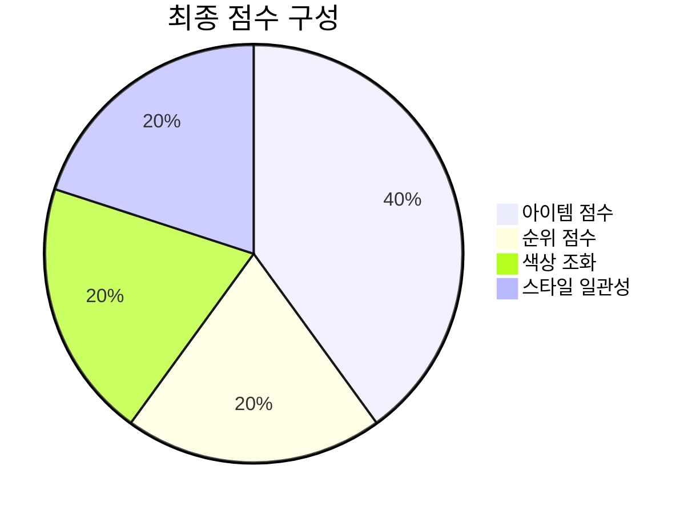

| 요소 | 비중 | 설명 |
|------|------|------|
| **아이템 점수** | 40% | 개별 아이템 점수 평균 |
| **순위 점수** | 20% | 상위 순위 아이템 조합 우대 |
| **색상 조화** | 20% | 아이템 쌍별 색상 조화 평균 |
| **스타일 일관성** | 20% | 지배적 스타일 호환성 |

### 4.3 색상 조화 규칙

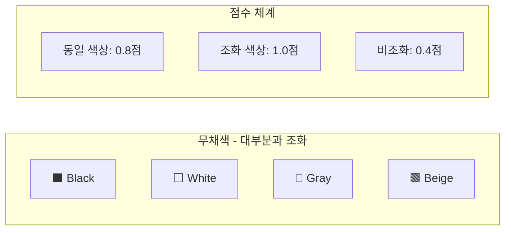

### 4.4 스타일 호환성 규칙

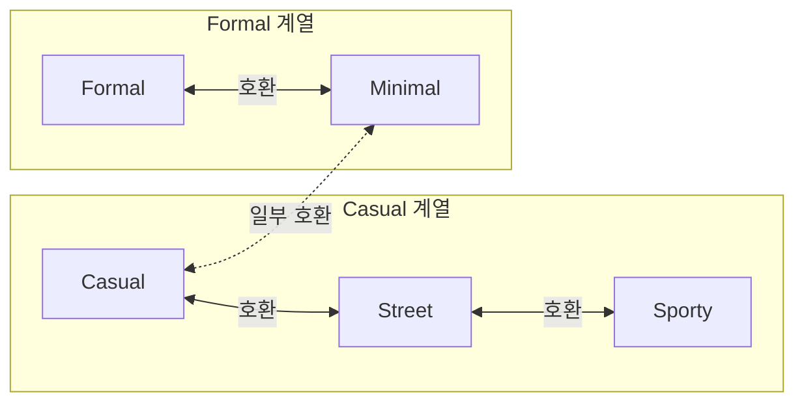

### 4.5 다양성 보장 알고리즘

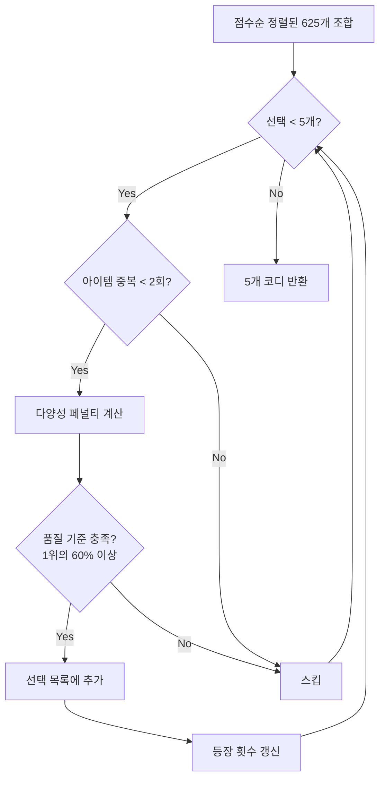

---

## 5. 날씨 서비스

### 5.1 기상청 API 연동 흐름

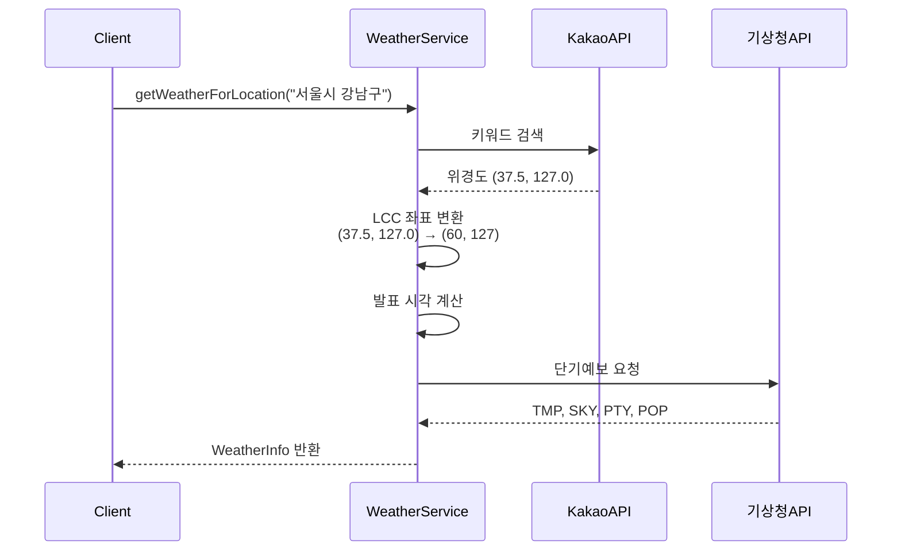

### 5.2 발표 시각 계산

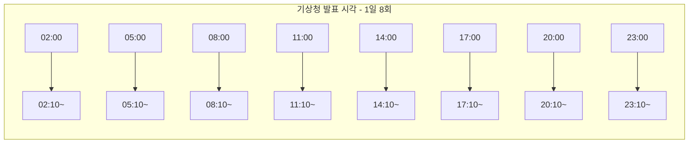

### 5.3 날씨 코드 매핑

| 카테고리 | 코드 | 의미 |
|----------|------|------|
| **SKY** | 1 | ☀️ 맑음 |
| | 3 | ⛅ 구름많음 |
| | 4 | ☁️ 흐림 |
| **PTY** | 0 | 없음 |
| | 1 | 🌧️ 비 |
| | 2 | 🌨️ 비/눈 |
| | 3 | ❄️ 눈 |
| | 4 | 🌦️ 소나기 |

---

## 6. 캘린더 연동

### 6.1 Google Calendar API 연동

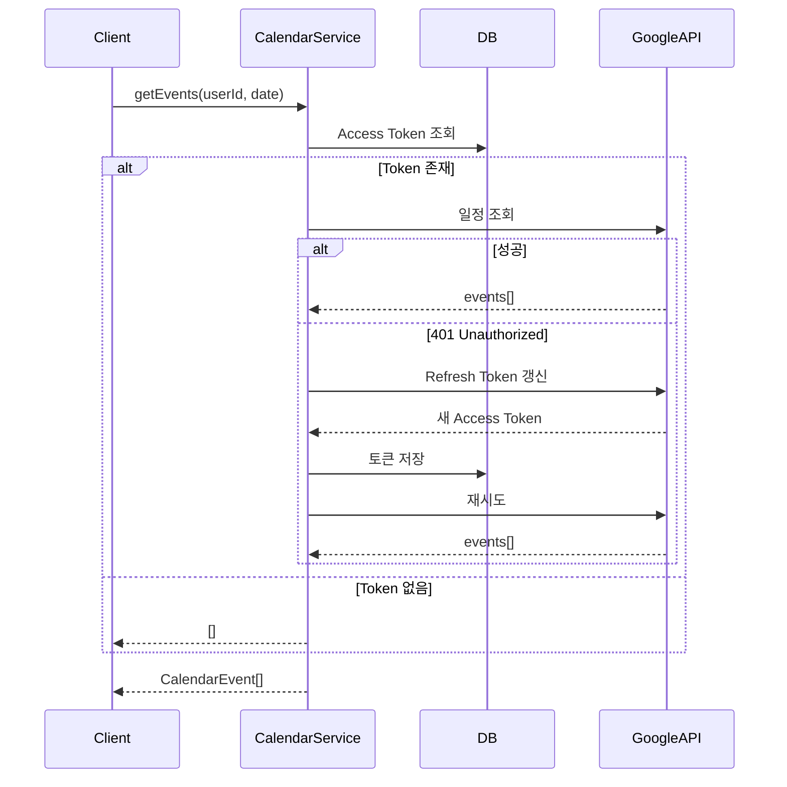

### 6.2 캘린더 + 날씨 + TPO 조합

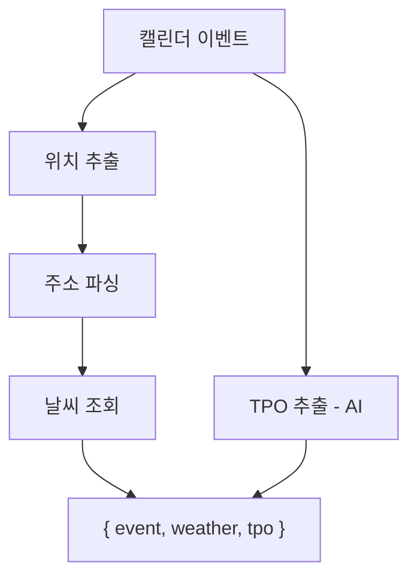

---

## 7. 피드백 시스템

### 7.1 피드백 타입

| 타입 | 설명 | 벡터 DB 영향 |
|------|------|--------------|
| `ACCEPT` | 추천 수락 | accept_count +1 |
| `REJECT` | 추천 거절 | reject_count +1 |
| `WORN` | 실제 착용 | wear_count +1, last_worn 갱신 |

### 7.2 멱등성 + 중복 방지 로직

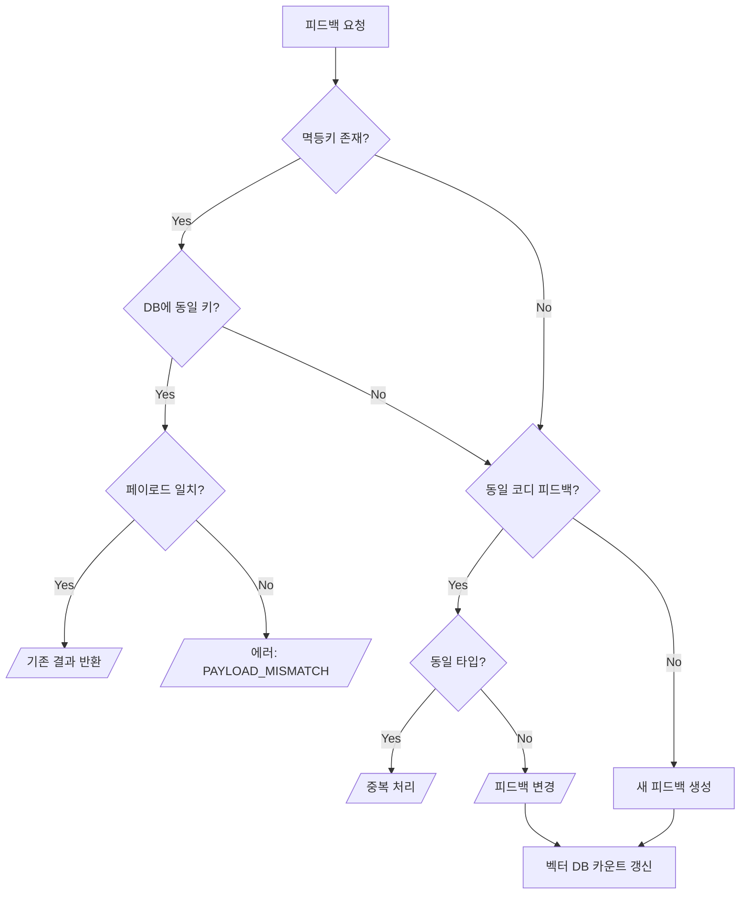

### 7.3 코디 해시 생성

```typescript
private hashOutfit(itemIds: string[]): string {
  const sorted = [...itemIds].sort().join(':');  // 순서 무관
  return crypto.createHash('sha256').update(sorted).digest('hex').slice(0, 16);
}
```

---

## 8. 데이터베이스 설계

### 8.1 ERD

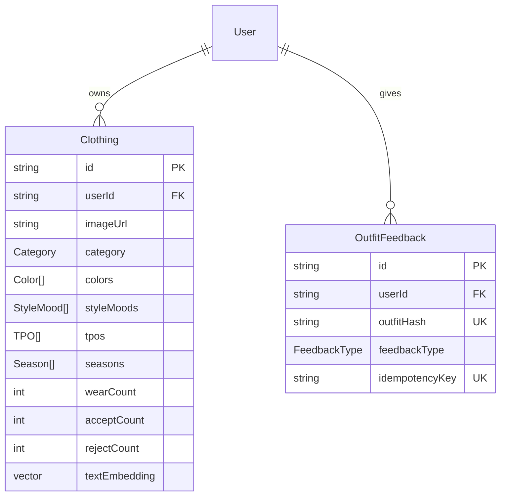

### 8.2 주요 Enum 정의

| Enum | 값 |
|------|-----|
| **Category** | Outer, Top, Bottom, Shoes, Other |
| **StyleMood** | Casual, Street, Minimal, Formal, Sporty, Vintage, Gorpcore |
| **TPO** | Date, Daily, Commute, Sports, Travel, Wedding, Party, Home, School |
| **Season** | Spring, Summer, Autumn, Winter |
| **FeedbackType** | ACCEPT, REJECT, WORN |

---

## 9. API 설계

### 9.1 API 엔드포인트

| 모듈 | 엔드포인트 | 메서드 | 설명 |
|------|------------|--------|------|
| **Recommendation** | `/recommendation/search` | POST | 코디 추천 검색 |
| | `/recommendation/feedback` | POST | 피드백 기록 |
| | `/recommendation/feedback` | DELETE | 피드백 취소 |
| **Weather** | `/weather/current` | GET | 현재 날씨 조회 |
| **Calendar** | `/calendar/today` | GET | 오늘 일정 |
| | `/calendar/today/tpo` | GET | 오늘 일정 + TPO |
| | `/calendar/today/context` | GET | 오늘 일정 + TPO + 날씨 |
| | `/calendar/upcoming` | GET | 오늘/내일 일정 |

### 9.2 검색 요청/응답 예시

**Request:**
```json
POST /recommendation/search
{
  "tpo": "데이트",
  "style": "캐주얼",
  "date": "2025-01-19"
}
```

**Response:**
```json
{
  "success": true,
  "context": {
    "tpo": "Date",
    "weather": { "temp": 5, "condition": "맑음", "rain_probability": 10 },
    "style": "캐주얼"
  },
  "outfits": [
    {
      "outer": { "id": "...", "image_url": "...", "score": 0.85 },
      "top": { "id": "...", "image_url": "...", "score": 0.82 },
      "bottom": { "id": "...", "image_url": "...", "score": 0.80 },
      "shoes": { "id": "...", "image_url": "...", "score": 0.78 },
      "scores": { "itemScore": 0.81, "colorHarmony": 0.85, "styleConsistency": 0.88 },
      "finalScore": 0.86
    }
  ],
  "meta": {
    "totalCandidates": { "outer": 10, "top": 10, "bottom": 10, "shoes": 10 },
    "appliedFilters": { "tpo": "Date", "season": "Winter", "style": "캐주얼" }
  }
}
```

---

## 10. 면접 예상 질문

### Q1. RAG에서 벡터 검색 vs 키워드 검색을 선택한 이유?

**A:** 패션 도메인의 특성 때문입니다.
- 의류는 "캐주얼한 느낌의 베이지 니트" 같은 추상적 표현이 많음
- CLIP 임베딩은 이미지-텍스트 의미를 동시에 학습
- 벡터 검색으로 의미적으로 가까운 옷 검색 가능

### Q2. 코사인 유사도를 선택한 이유?

**A:** CLIP 임베딩은 방향(의미)이 중요합니다.
- 유클리드 거리는 벡터 크기에 영향받음
- 코사인 유사도는 방향만 비교하여 의미 유사성 측정

### Q3. 다양성을 어떻게 보장하나요?

**A:** 로그 스케일 페널티 + 중복 제한
- 동일 아이템 최대 2회 출현 제한
- 중복 횟수에 로그 스케일 페널티
- 최소 품질 기준 (1위 대비 60% 이상)

### Q4. 기상청 API의 발표 시각 처리 이유?

**A:** API 특성상 발표시각 + 10분 이후에만 데이터 제공
- 잘못된 시각으로 요청 시 빈 데이터 반환
- 자정~02:10은 전날 23시 데이터 사용

### Q5. 피드백의 멱등성은 어떻게 보장하나요?

**A:** 두 단계로 보장
1. **idempotencyKey**: 네트워크 재시도 방지
2. **userId + outfitHash**: 동일 코디 중복 피드백 방지

### Q6. Google Calendar 토큰 만료 처리?

**A:** 자동 갱신 로직
1. 401 에러 → Refresh Token으로 갱신
2. DB에 새 토큰 저장 → 재시도
3. 실패 시 빈 배열 반환 (graceful degradation)

---

## 성능 벤치마크

| 작업 | 시간 | 비고 |
|------|------|------|
| 텍스트 임베딩 | ~100ms | CLIP (FastAPI) |
| 벡터 검색 | ~20ms | pgvector |
| 조합 생성 | ~50ms | 625개 |
| 날씨 조회 | ~500ms | 기상청 API |
| 캘린더 조회 | ~300ms | Google API |
| **전체 추천** | **~1초** | 모든 단계 |

---

## 환경 변수

```env
FASTAPI_URL=http://localhost:8000
WEATHER_API_KEY=기상청_API_키
KAKAO_API_KEY=카카오_API_키
GOOGLE_CLIENT_ID=구글_클라이언트_ID
GOOGLE_CLIENT_SECRET=구글_시크릿
DATABASE_URL=postgresql://...
```

---

## 참고 문서

- [pgvector](https://github.com/pgvector/pgvector)
- [CLIP Paper](https://arxiv.org/abs/2103.00020)
- [기상청 단기예보 API](https://www.data.go.kr/data/15084084/openapi.do)
- [Google Calendar API](https://developers.google.com/calendar/api)
- [Kakao Local API](https://developers.kakao.com/docs/latest/ko/local/dev-guide)