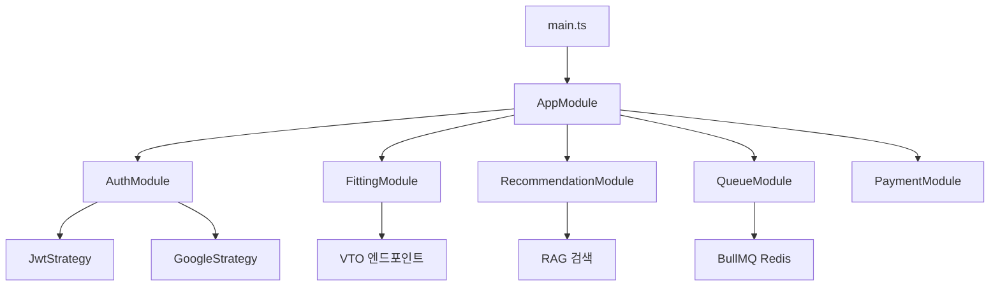
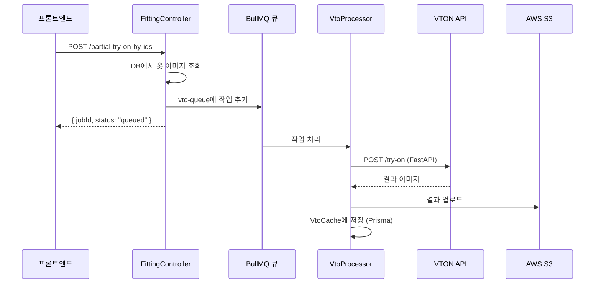
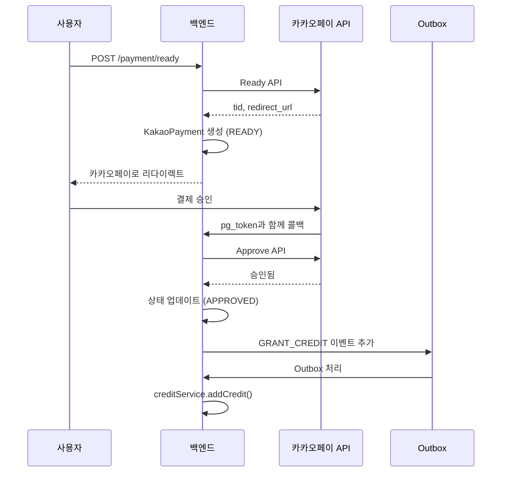

# CloszIT 백엔드 - 기술 심층 분석

> **생성일**: 2026-01-22 | **분석 유형**: 역공학 분석  
> **범위**: `/closzIT-back` - NestJS 백엔드

---

## 1. 아키텍처 개요

### 1.1 기술 스택 (`package.json` 기준)

| 레이어 | 기술 | 버전 |
|-------|------|------|
| **코어** | NestJS | ^11.0.1 |
| **언어** | TypeScript | ^5.7.3 |
| **ORM** | Prisma | ^5.22.0 |
| **데이터베이스** | PostgreSQL + pgvector | ^8.16.3 |
| **큐** | BullMQ + Redis | ^5.66.5 |
| **AI - Google** | @google/genai | ^1.34.0 |
| **AI - AWS** | @aws-sdk/client-bedrock-runtime | ^3.958.0 |
| **스토리지** | AWS S3 | ^3.965.0 |
| **인증** | Passport + JWT | ^0.7.0 |
| **웹 스크래핑** | Puppeteer + Cheerio | ^24.35.0 |
| **HTTP** | Axios | ^1.13.2 |

### 1.2 디렉토리 구조

```
closzIT-back/
├── prisma/
│   ├── schema/              # 12개 모듈화된 Prisma 스키마 파일
│   │   ├── base.prisma      # DB 연결 (PostgreSQL + pgvector)
│   │   ├── user.prisma      # 사용자 모델 (Google OAuth)
│   │   ├── clothing.prisma  # 임베딩 포함 옷 모델
│   │   ├── credit.prisma    # 크레딧 거래 이력
│   │   ├── social.prisma    # 게시물, 댓글, 좋아요, 팔로우
│   │   ├── kakaopay.prisma  # Outbox 패턴 포함 결제
│   │   ├── vto-cache.prisma # VTO 결과 캐싱
│   │   └── outfit-log.prisma # 착용 이력
│   └── migrations/          # 7개 마이그레이션 파일
├── src/
│   ├── main.ts              # 진입점 (CORS, body parser)
│   ├── app.module.ts        # 루트 모듈 (22개 임포트)
│   ├── prisma/              # Prisma 서비스 래퍼
│   ├── auth/                # Google OAuth + JWT 가드
│   ├── user/                # 사용자 프로필 관리
│   ├── items/               # 옷 CRUD
│   ├── analysis/            # AI 옷 분석 (CLIP, FashionSigLIP)
│   ├── fitting/             # VTO 엔드포인트 (33KB 컨트롤러!)
│   ├── recommendation/      # RAG 기반 코디 검색
│   ├── queue/               # BullMQ 작업 프로세서
│   ├── credit/              # 크레딧 시스템 (멱등)
│   ├── payment/             # 카카오페이 연동
│   ├── posts/               # SNS 게시물
│   ├── comments/            # 게시물 댓글
│   ├── likes/               # 게시물 좋아요
│   ├── follow/              # 사용자 팔로우
│   ├── outfit-log/          # 착용 추적
│   ├── weather/             # 날씨 API
│   ├── calendar/            # Google Calendar 연동
│   ├── s3/                  # AWS S3 서비스
│   ├── ai/                  # Bedrock + Google GenAI 서비스
│   ├── vton-cache/          # VTO 캐시 관리
│   ├── barcode/             # 상품 바코드 조회
│   └── crawl/               # 웹 스크래핑 (Puppeteer)
└── test/                    # E2E 테스트
```

### 1.3 진입점

| 파일 | 역할 |
|-----|------|
| [main.ts](file:///Users/hwiseo/Desktop/나만무/closzIT/closzIT-back/src/main.ts) | NestJS 부트스트랩, CORS, body parser (50MB 제한), Prisma 연결 확인 |
| [app.module.ts](file:///Users/hwiseo/Desktop/나만무/closzIT/closzIT-back/src/app.module.ts) | 22개 기능 모듈을 임포트하는 루트 모듈 |

**애플리케이션 흐름**:


---

## 2. 도메인 로직 & 데이터 흐름

### 2.1 인증 (Google OAuth + JWT)

**파일**:
- [auth.service.ts](file:///Users/hwiseo/Desktop/나만무/closzIT/closzIT-back/src/auth/auth.service.ts)
- `auth/strategies/google.strategy.ts`
- `auth/guards/jwt-auth.guard.ts`

**흐름**:
```
프론트엔드 → /auth/google → Google OAuth → GoogleStrategy.validate() →
AuthService.validateGoogleUser() → 사용자 Upsert (Prisma) →
AuthService.generateToken() → JWT → 프론트엔드 localStorage
```

**주요 메서드**:
- `validateGoogleUser()`: Google 프로필에서 사용자 생성 또는 업데이트
- `generateToken()`: 사용자 ID와 이메일로 JWT 서명

---

### 2.2 가상 피팅(VTO) 시스템

**핵심 파일**:
- [fitting.controller.ts](file:///Users/hwiseo/Desktop/나만무/closzIT/closzIT-back/src/fitting/fitting.controller.ts) (1039줄 - **가장 큰 파일**)
- [fitting.service.ts](file:///Users/hwiseo/Desktop/나만무/closzIT/closzIT-back/src/fitting/fitting.service.ts) (590줄)
- `queue/processors/vto.processor.ts`

**VTO 엔드포인트**:
| 엔드포인트 | 메서드 | 목적 |
|-----------|--------|------|
| `/api/fitting/virtual-try-on` | POST | 전체 코디 VTO (모든 카테고리) |
| `/api/fitting/partial-try-on` | POST | 부분 VTO (파일 업로드) |
| `/api/fitting/partial-try-on-by-ids` | POST | 부분 VTO (옷 ID) |
| `/api/fitting/single-item-try-on` | POST | 단일 아이템 VTO |
| `/api/fitting/sns-full-try-on` | POST | SNS 게시물 VTO (큐 기반) |
| `/api/fitting/vto-history` | GET | 사용자 VTO 결과 조회 |

**데이터 흐름 (큐 기반)**:


**크레딧 차감**: VTO 작업당 3크레딧 (프로세서에서 호출)

---

### 2.3 AI 옷 분석

**파일**:
- [analysis.service.ts](file:///Users/hwiseo/Desktop/나만무/closzIT/closzIT-back/src/analysis/analysis.service.ts) (531줄)

**기능**:
| 메서드 | 목적 | AI 서비스 |
|--------|------|----------|
| `analyzeImage()` | 옷 카테고리, 스타일, 색상 감지 | FastAPI (YOLO + CLIP) |
| `flattenClothing()` | 플랫레이 이미지 생성 | Google GenAI (Gemini) |
| `findSimilarItems()` | 벡터 유사도 검색 | pgvector |
| `saveItems()` | 임베딩과 함께 저장 | Prisma + FashionSigLIP |

**옷 펴기 흐름**:
```
이미지 Base64 → Google GenAI (Gemini imagen) → 
생성된 플랫레이 이미지 → S3 업로드 → 
Clothing.flattenImageUrl 업데이트 → 1크레딧 차감
```

---

### 2.4 코디 추천 (RAG 기반)

**파일**:
- [recommendation.controller.ts](file:///Users/hwiseo/Desktop/나만무/closzIT/closzIT-back/src/recommendation/recommendation.controller.ts)
- `recommendation/services/rag-search.service.ts`
- `recommendation/services/scoring.service.ts` (12KB)
- `recommendation/services/vector-db.service.ts`
- `recommendation/services/feedback.service.ts`

**검색 엔드포인트**: `POST /recommendation/search`

**컨텍스트 구성**:
1. **TPO 결정**: 직접 입력 → 사용자 쿼리 (AI) → 캘린더 일정
2. **날씨**: 사용자 위치 또는 캘린더 일정에서 조회
3. **스타일**: 선택적 필터

**RAG 검색 파이프라인**:
```
SearchContext (TPO, 날씨, 스타일) →
VectorDbService (pgvector 유사도) →
ScoringService (규칙 기반 점수화) →
RagSearchService (코디 조합) →
OutfitSearchResults
```

**피드백 시스템**: 수락/거절 → `OutfitFeedback` 테이블 → 옷 평점 조정

---

### 2.5 크레딧 시스템

**파일**:
- [credit.service.ts](file:///Users/hwiseo/Desktop/나만무/closzIT/closzIT-back/src/credit/credit.service.ts) (321줄)

**거래 유형**:
| 유형 | 수량 | 트리거 |
|------|------|--------|
| `SIGNUP` | +10 | 신규 사용자 등록 |
| `CLOTHING_ADDED` | +1 | 새 옷 등록 |
| `VTO_USED` | -3 | 가상 피팅 |
| `FLATTEN_USED` | -1 | 옷 펴기 |
| `PURCHASE` | +N | 카카오페이 구매 |
| `PIN_REDEEM` | +N | 프로모션 코드 사용 |

**멱등성**: 모든 작업이 중복 거래 방지를 위해 `idempotencyKey` 지원

**무결성 검사**: `verifyIntegrity()`로 캐시된 잔액과 계산된 합계 비교

---

### 2.6 결제 시스템 (카카오페이)

**파일**:
- `payment/kakaopay.service.ts`
- Prisma: [kakaopay.prisma](file:///Users/hwiseo/Desktop/나만무/closzIT/closzIT-back/prisma/schema/kakaopay.prisma)

**결제 흐름**:


**Outbox 패턴**: `PaymentOutbox` 테이블로 크레딧 지급의 최종 일관성 보장

---

### 2.7 작업 큐 시스템 (BullMQ)

**파일**:
- [queue.module.ts](file:///Users/hwiseo/Desktop/나만무/closzIT/closzIT-back/src/queue/queue.module.ts)
- `queue/processors/flatten.processor.ts`
- `queue/processors/vto.processor.ts`

**큐**:
| 큐 이름 | 프로세서 | 목적 |
|--------|----------|------|
| `flatten-queue` | FlattenProcessor | AI 옷 펴기 |
| `vto-queue` | VtoProcessor | 가상 피팅 작업 |

**Redis 연결**: `REDIS_HOST`와 `REDIS_PORT` 환경 변수로 설정

---

## 3. 상태 & 데이터베이스 분석

### 3.1 데이터베이스: PostgreSQL + pgvector

**연결**: `base.prisma` (postgresqlExtensions 프리뷰 기능 사용)

**벡터 확장**: 임베딩 유사도 검색을 위한 `pgvector`

### 3.2 데이터 모델

**User** ([user.prisma](file:///Users/hwiseo/Desktop/나만무/closzIT/closzIT-back/prisma/schema/user.prisma)):
```
┌──────────────────────────────────────────────────────┐
│ User                                                  │
├──────────────────────────────────────────────────────┤
│ id: UUID                                              │
│ email: String (고유)                                   │
│ googleId, googleAccessToken, googleRefreshToken      │
│ name, profileImage, fullBodyImage                    │
│ gender, birthday, province, city                     │
│ personalColor, hairColor, bodyType, height, weight   │
│ preferredStyles: String[]                            │
│ credit: Int                                          │
│ isProfileComplete: Boolean                           │
├──────────────────────────────────────────────────────┤
│ 관계: clothes, posts, comments, likes, follows       │
└──────────────────────────────────────────────────────┘
```

**Clothing** ([clothing.prisma](file:///Users/hwiseo/Desktop/나만무/closzIT/closzIT-back/prisma/schema/clothing.prisma)):
```
┌──────────────────────────────────────────────────────┐
│ Clothing                                              │
├──────────────────────────────────────────────────────┤
│ id: UUID                                              │
│ userId: FK → User                                    │
│ imageUrl, flattenImageUrl                            │
│ category: Outer | Top | Bottom | Shoes               │
│ subCategory: String                                  │
│ colors, patterns, details, styleMoods: Enum[]        │
│ tpos, seasons: Enum[]                                │
│ wearCount, lastWorn, userRating                      │
│ acceptCount, rejectCount (추천 피드백)                │
│ textEmbedding, image_embedding: vector               │
└──────────────────────────────────────────────────────┘
```

**VtoCache** ([vto-cache.prisma](file:///Users/hwiseo/Desktop/나만무/closzIT/closzIT-back/prisma/schema/vto-cache.prisma)):
```
┌──────────────────────────────────────────────────────┐
│ VtoCache                                              │
├──────────────────────────────────────────────────────┤
│ id: UUID                                              │
│ hashKey: String (고유) - 조합 해시                    │
│ userId, postId, clothingIds[]                        │
│ s3Url: 결과 이미지 URL                                │
│ isVisible: Boolean (소프트 삭제)                      │
│ seen: Boolean (알림 상태)                             │
└──────────────────────────────────────────────────────┘
```

### 3.3 Enum 정의

**`clothing_enums.prisma` 기준**:
- **Category**: `Outer`, `Top`, `Bottom`, `Shoes`, `Other`
- **Color**: 20개 색상 (Black, White, Navy, Beige 등)
- **Pattern**: Solid, Stripe, Check, Dot 등
- **TPO**: Daily, Commute, Date, Sports, Travel, Wedding, Party 등
- **Season**: Spring, Summer, Autumn, Winter
- **StyleMood**: Casual, Formal, Sporty, Vintage 등

---

## 4. 리팩토링 보고서 (사실 기반)

### 4.1 발견된 코드 스멜

| 문제 | 위치 | 심각도 | 설명 |
|-----|------|--------|-----|
| **대형 컨트롤러** | `fitting.controller.ts` | 🔴 높음 | 15개 이상 엔드포인트가 있는 1039줄. 서브 컨트롤러로 분리 필요. |
| **대형 서비스** | `fitting.service.ts` | 🟡 중간 | 590줄 - 관리 가능하지만 헬퍼 추출 가능. |
| **대형 서비스** | `analysis.service.ts` | 🟡 중간 | 531줄 - 분석, 펴기, 유사도 검색 처리. |
| **점수화 복잡도** | `scoring.service.ts` | 🟡 중간 | 12KB 점수화 규칙 - 설정 기반 접근 고려. |
| **하드코딩된 URL** | 여러 파일 | 🟢 낮음 | 환경 변수 사용하지만 폴백 하드코딩 값 존재. |

### 4.2 아키텍처 장점

| 패턴 | 구현 |
|-----|------|
| ✅ **모듈화 구조** | 22개 독립 NestJS 모듈 |
| ✅ **큐 기반 처리** | 장시간 VTO 작업용 BullMQ |
| ✅ **멱등 트랜잭션** | 크레딧 작업이 멱등키 지원 |
| ✅ **Outbox 패턴** | 결제 → 크레딧 지급 일관성 |
| ✅ **벡터 검색** | 임베딩 유사도용 pgvector |
| ✅ **스키마 분리** | 12개 집중된 Prisma 스키마 파일 |

### 4.3 잠재적 개선 사항

1. **FittingController 분리**:
   - `VirtualTryOnController` (VTO 엔드포인트)
   - `VtoHistoryController` (히스토리 관리)
   - `SingleItemController` (단일 아이템 입어보기)

2. **이미지 유틸리티 추출**: `fetchImageAsBase64()`와 `fetchImageAsBuffer()`가 여러 곳에 있음

3. **AI 설정 중앙화**: Bedrock과 GenAI 클라이언트가 여러 서비스에서 초기화됨

---

## 5. 외부 서비스 의존성

| 서비스 | 목적 | 설정 |
|-------|------|-----|
| **FastAPI (YOLO/CLIP)** | 옷 감지 & 임베딩 | `FASTAPI_URL` |
| **IDM-VTON API** | 가상 피팅 생성 | `VTON_API_URL` |
| **Google GenAI** | 옷 펴기 & TPO 추출용 Gemini | `GOOGLE_API_KEY` |
| **AWS Bedrock** | AI 작업용 Claude | `AWS_REGION` |
| **AWS S3** | 이미지 저장소 | `AWS_S3_BUCKET` |
| **Redis** | BullMQ 큐 백엔드 | `REDIS_HOST`, `REDIS_PORT` |
| **카카오페이 API** | 결제 처리 | 카카오페이 자격 증명 |
| **Google Calendar** | 사용자 캘린더 일정 | OAuth 토큰 |

---

## 6. API 엔드포인트 요약

### 인증
| 메서드 | 엔드포인트 | 인증 | 목적 |
|--------|-----------|------|------|
| GET | `/auth/google` | - | OAuth 리다이렉트 |
| GET | `/auth/google/callback` | - | OAuth 콜백 |
| POST | `/auth/logout` | JWT | 로그아웃 |

### 사용자
| 메서드 | 엔드포인트 | 인증 | 목적 |
|--------|-----------|------|------|
| GET | `/user/me` | JWT | 현재 사용자 조회 |
| PATCH | `/user/profile` | JWT | 프로필 업데이트 |
| POST | `/user/full-body-image` | JWT | 피팅 모델 업로드 |

### 옷
| 메서드 | 엔드포인트 | 인증 | 목적 |
|--------|-----------|------|------|
| GET | `/items` | JWT | 사용자 옷 목록 |
| POST | `/items` | JWT | 옷 생성 |
| PATCH | `/items/:id` | JWT | 옷 업데이트 |
| DELETE | `/items/:id` | JWT | 옷 삭제 |
| POST | `/clothing/analyze` | JWT | AI 분석 |
| POST | `/clothing/flatten` | JWT | 플랫레이 생성 |

### VTO
| 메서드 | 엔드포인트 | 인증 | 목적 |
|--------|-----------|------|------|
| POST | `/api/fitting/partial-try-on-by-ids` | JWT | ID로 VTO |
| POST | `/api/fitting/sns-full-try-on` | JWT | SNS VTO |
| POST | `/api/fitting/single-item-try-on` | JWT | 단일 아이템 |
| GET | `/api/fitting/vto-history` | JWT | 히스토리 조회 |

### 추천
| 메서드 | 엔드포인트 | 인증 | 목적 |
|--------|-----------|------|------|
| POST | `/recommendation/search` | JWT | 코디 추천 받기 |
| POST | `/recommendation/feedback` | JWT | 수락/거절 기록 |

### 크레딧 & 결제
| 메서드 | 엔드포인트 | 인증 | 목적 |
|--------|-----------|------|------|
| GET | `/credit` | JWT | 잔액 조회 |
| GET | `/credit/history` | JWT | 거래 이력 |
| POST | `/payment/ready` | JWT | 결제 시작 |
| GET | `/payment/approve` | JWT | 승인 콜백 |

---

## 7. 환경 설정

`.env.example` 기준:
```
# AI 서버
FASTAPI_URL=http://localhost:8000       # YOLO, CLIP, 임베딩
VTON_API_URL=http://localhost:8001      # IDM-VTON, DensePose

# 데이터베이스
DATABASE_URL=postgresql://...

# AWS
AWS_REGION=ap-northeast-1
AWS_S3_REGION=ap-northeast-2
AWS_S3_BUCKET=...

# Redis (BullMQ)
REDIS_HOST=localhost
REDIS_PORT=6379

# 인증
JWT_SECRET=...
GOOGLE_API_KEY=...
```

---

*기술 심층 분석 끝*
