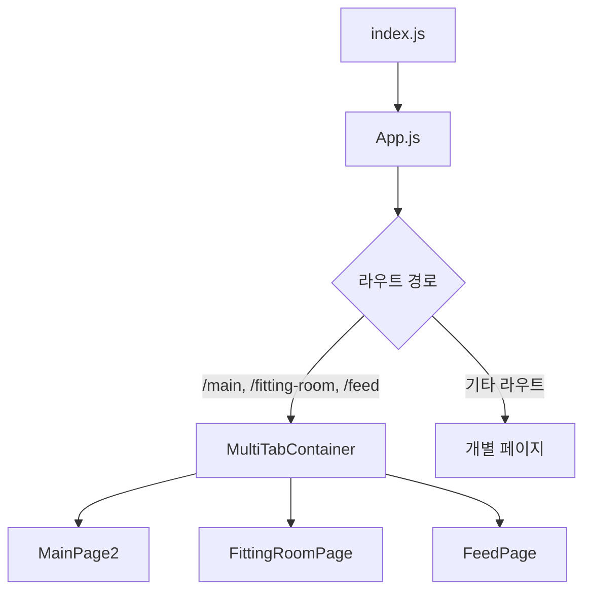
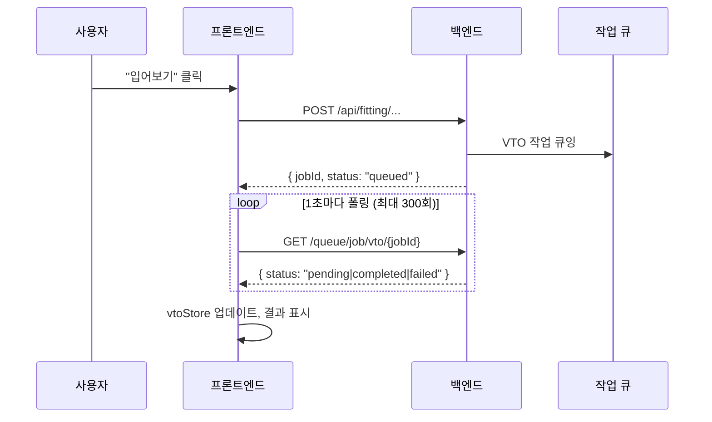

# CloszIT 프론트엔드 - 기술 심층 분석

> **생성일**: 2026-01-22 | **분석 유형**: 역공학 분석  
> **범위**: `/closzIT-front` - React PWA 프론트엔드

---

## 1. 아키텍처 개요

### 1.1 기술 스택 (`package.json` 기준)

| 레이어 | 기술 | 버전 |
|-------|------|------|
| **코어** | React | ^18.2.0 |
| **라우팅** | react-router-dom | ^6.30.3 |
| **상태 관리** | Zustand | ^5.0.10 |
| **HTTP 클라이언트** | Axios | ^1.13.2 |
| **스타일링** | TailwindCSS | ^3.3.6 |
| **차트** | @nivo/pie | ^0.99.0 |
| **아이콘** | react-icons | ^5.5.0 |
| **PWA** | Workbox | ^6.6.0 |
| **바코드** | html5-qrcode | ^2.3.8 |

### 1.2 디렉토리 구조

```
closzIT-front/
├── public/
│   ├── assets/              # 정적 이미지 (마스코트, 아이콘)
│   ├── manifest.json        # PWA 매니페스트
│   └── index.html           # HTML 진입점
├── src/
│   ├── components/          # 13개 재사용 UI 컴포넌트
│   │   ├── MultiTabContainer.jsx   # 탭 기반 네비게이션 컨테이너
│   │   ├── SharedHeader.jsx        # 글로벌 헤더 (VTO 상태 포함)
│   │   ├── BottomNav.jsx           # 하단 네비게이션 (FAB 포함)
│   │   ├── VtoResultModal.jsx      # VTO 결과 표시 모달
│   │   ├── ClothDetailModal.jsx    # 옷 상세 보기
│   │   └── ...                     # 기타 모달/UI 컴포넌트
│   ├── pages/               # 13개 이상 페이지 디렉토리, 6개 루트 페이지
│   │   ├── Login/           # 구글 OAuth 플로우
│   │   ├── Main/            # 대시보드, 코디 추천
│   │   ├── Fitting/         # AI 피팅 페이지
│   │   ├── Register/        # 옷 등록
│   │   ├── Labeling/        # AI 옷 분석
│   │   ├── Credit/          # 인앱 구매
│   │   └── ...              # 기타 기능 페이지
│   ├── stores/              # 4개 Zustand 스토어
│   │   ├── appStore.js      # 날씨, 캘린더, 전역 상태
│   │   ├── userStore.js     # 사용자 프로필, 인증, 크레딧
│   │   ├── tabStore.js      # 탭 네비게이션 상태
│   │   └── vtoStore.js      # 가상 피팅 상태 & API
│   ├── utils/               # 유틸리티 함수
│   │   └── vtoStorage.js    # VTO 결과 sessionStorage 관리자
│   ├── App.js               # 메인 라우터 설정
│   ├── index.js             # 진입점, PWA 등록
│   └── index.css            # 글로벌 CSS, 디자인 시스템
├── .env.development         # 개발: localhost:3000
├── .env.production          # 운영: api.closzit.shop
└── tailwind.config.js       # 커스텀 테마 (럭셔리 옷장)
```

### 1.3 진입점

| 파일 | 역할 |
|-----|------|
| [index.js](file:///Users/hwiseo/Desktop/나만무/closzIT/closzIT-front/src/index.js) | React 18 루트 렌더링, PWA 서비스 워커 등록 |
| [App.js](file:///Users/hwiseo/Desktop/나만무/closzIT/closzIT-front/src/App.js) | BrowserRouter (20개 이상 라우트), 메인 탭용 MultiTabContainer |

**애플리케이션 흐름**:


---

## 2. 도메인 로직 & 데이터 흐름

### 2.1 인증 (Google OAuth)

**파일**: 
- [LoginPage.jsx](file:///Users/hwiseo/Desktop/나만무/closzIT/closzIT-front/src/pages/Login/LoginPage.jsx)
- [AuthCallbackPage.jsx](file:///Users/hwiseo/Desktop/나만무/closzIT/closzIT-front/src/pages/Login/AuthCallbackPage.jsx)

**흐름**:
```
[사용자] → GoogleLoginButton → 백엔드 /auth/google → Google OAuth → 
백엔드 콜백 → JWT 토큰 → localStorage → /main으로 리다이렉트
```

**토큰 검증**: `userStore.checkTokenValidity()`로 앱 로드 시 JWT 검증 및 사용자 프로필 조회

---

### 2.2 가상 피팅(VTO) 시스템

**핵심 파일**:
- [vtoStore.js](file:///Users/hwiseo/Desktop/나만무/closzIT/closzIT-front/src/stores/vtoStore.js) (559줄)
- [vtoStorage.js](file:///Users/hwiseo/Desktop/나만무/closzIT/closzIT-front/src/utils/vtoStorage.js)

**VTO 유형**:
| 유형 | 트리거 | API 엔드포인트 |
|------|--------|---------------|
| `full` | SNS 게시물 입어보기 | `/api/fitting/sns-full-try-on` |
| `single` | 원클릭 입어보기 | `/api/fitting/partial-try-on-by-ids` |

**데이터 흐름 (큐 기반)**:


**크레딧 시스템**:
- VTO 작업당 3크레딧 필요
- `CreditConfirmModal`로 실행 전 확인
- `useUserStore.deductCredit()`로 로컬 차감 처리

---

### 2.3 옷 등록 & AI 라벨링

**파일**:
- [RegisterPage.jsx](file:///Users/hwiseo/Desktop/나만무/closzIT/closzIT-front/src/pages/Register/RegisterPage.jsx) (410줄)
- [LabelingPage.jsx](file:///Users/hwiseo/Desktop/나만무/closzIT/closzIT-front/src/pages/Labeling/LabelingPage.jsx) (1657줄 - 가장 큰 컴포넌트)

**등록 옵션**: 앨범 업로드, 카메라 촬영, 웹 캡처, 바코드 스캔

**라벨링 흐름**:
```
[이미지] → /clothing/analyze (AI) → 카테고리/스타일 감지 →
사용자 확인 → /clothing/flatten (선택) → DB에 저장
```

**AI 분석 필드**: 카테고리, 색상, 패턴, 계절, TPO, 스타일 무드, 디테일

---

### 2.4 메인 대시보드 & 탭 네비게이션

**파일**:
- [MultiTabContainer.jsx](file:///Users/hwiseo/Desktop/나만무/closzIT/closzIT-front/src/components/MultiTabContainer.jsx)
- [MainPage2.jsx](file:///Users/hwiseo/Desktop/나만무/closzIT/closzIT-front/src/pages/Main/MainPage2.jsx)
- [tabStore.js](file:///Users/hwiseo/Desktop/나만무/closzIT/closzIT-front/src/stores/tabStore.js)

**탭 아키텍처**:
- **지연 로딩**: 탭은 첫 방문 시 초기화 (`isTabInitialized`)
- **상태 보존**: 3개 메인 탭은 항상 마운트됨 (display 토글)
- **슬라이드 애니메이션**: 방향 기반 CSS 트랜스폼

**탭**: 메인(Me) → 피팅룸 → SNS 피드

---

### 2.5 SNS 피드 시스템

**파일**: [FeedPage.jsx](file:///Users/hwiseo/Desktop/나만무/closzIT/closzIT-front/src/pages/FeedPage.jsx) (1434줄)

**기능**:
- 이미지 업로드 포함 게시물 생성/수정
- 낙관적 업데이트 포함 좋아요/좋아요 취소
- `CommentBottomSheet`를 통한 댓글
- 팔로우/언팔로우
- VTO 통합 (게시물에서 코디 입어보기)

---

### 2.6 코디 추천

**파일**: [OutfitRecommender.jsx](file:///Users/hwiseo/Desktop/나만무/closzIT/closzIT-front/src/pages/Main/OutfitRecommender.jsx)

**입력 파라미터**:
- 캘린더 일정 (Google Calendar API 연동)
- TPO 선택 (15개 옵션)
- 스타일 선택 (8개 옵션)
- 자유 텍스트 검색

**출력**: 추천 페이로드와 함께 `/fitting`으로 이동

---

## 3. 상태 & 데이터베이스 분석

### 3.1 Zustand 스토어 아키텍처

| 스토어 | 목적 | 주요 상태 |
|-------|------|----------|
| **appStore** | 전역 앱 상태 | `weather`, `upcomingEvents`, `userName`, 캐시 타임스탬프 |
| **userStore** | 사용자 인증 & 프로필 | `user`, `userId`, `userCredit`, `isProfileComplete`, 프로필 필드 |
| **tabStore** | 네비게이션 상태 | `activeTab`, `slideDirection`, `initializedTabs`, `pendingTryOnCloth` |
| **vtoStore** | VTO 작업 | `vtoResults`, `vtoLoadingPosts`, `unseenCount`, `showCreditModal` |

### 3.2 데이터 캐싱 전략

| 데이터 | 캐시 유효 시간 | 전략 |
|-------|--------------|------|
| 날씨 | 1시간 | 오래되면 갱신 |
| 캘린더 일정 | 5분 | Stale-While-Revalidate |
| 사용자 프로필 | 5분 | 요청 시 강제 갱신 |
| VTO 결과 | 세션 | sessionStorage (탭 범위) |

### 3.3 데이터 모델 (프론트엔드 뷰)

**사용자 프로필**:
```typescript
interface User {
  id: number;
  name: string;
  email: string;
  credit: number;
  fullBodyImage: string | null;
  profileImage: string | null;
  isProfileComplete: boolean;
  gender: string;
  birthday: Date | null;
  province: string;
  city: string;
  personalColor: string;
  height: number | null;
  weight: number | null;
  bodyType: string;
  preferredStyles: string[];
}
```

**옷 아이템**:
```typescript
interface ClothingItem {
  id: number;
  category: 'Outer' | 'Top' | 'Bottom' | 'Shoes';
  subcategory: string;
  colors: string[];
  seasons: string[];
  tpos: string[];
  styleMoods: string[];
  patterns: string[];
  details: string[];
  imageUrl: string;
  flattenedImageUrl?: string;
}
```

---

## 4. 리팩토링 보고서 (사실 기반)

### 4.1 발견된 코드 스멜

| 문제 | 위치 | 심각도 | 설명 |
|-----|------|--------|-----|
| **대형 컴포넌트** | `LabelingPage.jsx` | 🔴 높음 | 1657줄 - 이미지 회전, API 호출, 폼 상태, 멀티 아이템 캐러셀 처리. 분리 필요. |
| **대형 컴포넌트** | `FeedPage.jsx` | 🔴 높음 | 1434줄 - 피드 목록, 게시물 상세, 댓글, 옷장, 팔로우 로직 통합. |
| **대형 컴포넌트** | `FittingRoomPage.jsx` | 🟡 중간 | 1068줄 - 관리 가능하지만 히스토리와 코디 선택 로직 추출 가능. |
| **하드코딩된 옵션** | 여러 파일 | 🟡 중간 | TPO, 스타일, 색상 옵션이 `LabelingPage`, `FittingRoomPage`, `OutfitRecommender`에 중복. 중앙화 필요. |
| **혼합된 관심사** | `vtoStore.js` | 🟡 중간 | 559줄 - VTO 상태, API 호출, 크레딧 확인, 애니메이션 통합. |

### 4.2 중복 코드 패턴

```javascript
// 5개 이상 파일에서 나타나는 패턴
const backendUrl = process.env.REACT_APP_BACKEND_URL || 'http://localhost:3000';
const getToken = () => localStorage.getItem('accessToken');
```

**권장사항**: 설정된 Axios 인스턴스로 `src/lib/api.js` 생성

### 4.3 네이밍 불일치

| 파일 | 예상 | 실제 |
|-----|------|-----|
| `MainPage2.jsx` | 기본 메인 페이지 | ✅ 현재 메인으로 사용 중 (MainPage와 교체됨) |
| `vtoStorage.js` | 활성 유틸리티 | ⚠️ 부분 비권장 - 현재 `vtoStore.refreshVtoData()`를 통해 백엔드 DB 사용 |

### 4.4 긍정적 패턴

- ✅ 상태 관리에 Zustand 일관되게 사용
- ✅ 도메인별 스토어 명확한 분리
- ✅ `appStore`에서 SWR 스타일 캐싱
- ✅ `index.css`와 `tailwind.config.js`의 포괄적인 디자인 시스템
- ✅ 성능을 위한 지연 탭 로딩

---

## 5. 설정 분석

### 5.1 환경 변수

| 변수 | 개발 | 운영 |
|-----|------|-----|
| `REACT_APP_BACKEND_URL` | `http://localhost:3000` | `https://api.closzit.shop` |
| `REACT_APP_DEMO_SET_ID` | `1` | `1` |
| `REACT_APP_FLATTEN_TIMEOUT_MS` | `5000` | `5000` |
| `REACT_APP_USE_DEMO_FALLBACK` | `false` | `true` |

### 5.2 디자인 시스템 (럭셔리 옷장 테마)

**색상 팔레트** (`tailwind.config.js` 기준):
| 토큰 | Hex | 용도 |
|-----|-----|-----|
| `cream` | `#FAF8F5` | 기본 배경 |
| `gold` | `#C9A86C` | 강조, CTA 버튼 |
| `gold-light` | `#E5D4B3` | 테두리, 하이라이트 |
| `charcoal` | `#2D2A26` | 기본 텍스트 |

**타이포그래피**: Outfit (디스플레이), Noto Sans KR (본문)

---

## 6. API 엔드포인트 (프론트엔드 관점)

| 엔드포인트 | 메서드 | 사용처 | 목적 |
|-----------|--------|--------|------|
| `/auth/google` | GET | LoginPage | OAuth 리다이렉트 |
| `/user/me` | GET | userStore | 사용자 프로필 조회 |
| `/weather/current` | GET | appStore | 날씨 데이터 |
| `/calendar/upcoming` | GET | appStore, OutfitRecommender | 캘린더 일정 |
| `/clothing/analyze` | POST | LabelingPage | AI 옷 분석 |
| `/clothing/flatten` | POST | LabelingPage | 옷 펴기 이미지 생성 |
| `/api/fitting/partial-try-on-by-ids` | POST | vtoStore | 옷 ID로 VTO |
| `/api/fitting/sns-full-try-on` | POST | vtoStore | 전체 코디 VTO |
| `/queue/job/vto/{jobId}` | GET | vtoStore | 작업 상태 폴링 |
| `/api/fitting/vto-history` | GET | vtoStore | VTO 결과 히스토리 |
| `/credit/purchase` | POST | CreditShopPage | 크레딧 구매 |

---

## 7. PWA 설정

**서비스 워커**: `serviceWorkerRegistration.register()`를 통해 `index.js`에서 등록

**사용된 Workbox 모듈**:
- Background Sync
- Cacheable Response  
- Precaching
- Routing/Strategies

**매니페스트** (`public/manifest.json`): 설치 가능성을 위한 표준 PWA 설정

---

*기술 심층 분석 끝*
