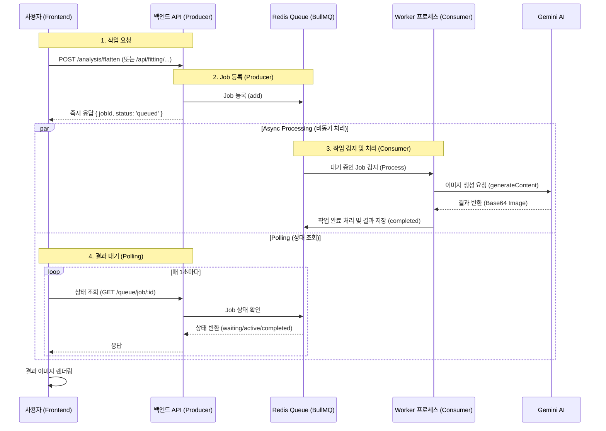

# 큐잉(Queuing) 시스템 기술 분석 문서

## 개요
이 문서는 `closzIT` 프로젝트의 **'옷 펴기(Flattening)'**와 **'가상 착장(VTO)'** 기능에 적용된 큐잉 시스템의 동작 원리를 기술적으로 설명합니다.

이 시스템은 **비동기 처리(Asynchronous Processing)** 패턴을 사용하여, 시간이 오래 걸리는 AI 모델 추론 작업을 사용자 경험 저해 없이 백그라운드에서 안정적으로 처리하도록 설계되었습니다.

## 아키텍처 다이어그램

데이터 흐름은 **Producer(API) → Queue(Redis) → Consumer(Worker) → AI Service → Result Store** 구조를 따릅니다.



## 상세 동작 원리

### 1. 작업 요청 (Producer)
사용자가 기능을 요청하면 백엔드는 작업을 직접 수행하지 않고 큐에 등록 후 즉시 응답합니다.

- **Frontend**: `LabelingPage.jsx`, `vtoStore.js`
- **Backend**: `AnalysisController` (`/analysis/flatten`), `FittingController` (`/api/fitting/*`)
- **역할**: `BullMQ`의 `queue.add()` 메서드를 사용하여 Redis에 작업을 직렬화하여 저장하고, 생성된 `jobId`를 클라이언트에 반환합니다.

```typescript
// 예시: Controller에서의 Job 등록
@Post('flatten')
async flattenClothing(@Body() body: FlattenDto) {
    // 큐에 작업 추가 (Non-blocking)
    const job = await this.flattenQueue.add('flatten', {
        userId: body.userId,
        imageBase64: body.imageBase64,
        // ...
    });

    // 즉시 응답
    return {
        success: true,
        jobId: job.id,
        status: 'queued', 
    };
}
```

### 2. 작업 처리 (Consumer/Worker)
백그라운드에서 실행되는 Worker 프로세스가 큐의 작업을 가져와 처리합니다.

- **Component**: `FlattenProcessor`, `VtoProcessor` (`src/queue/processors/`)
- **설정**: `concurrency: 3` (동시에 최대 3개의 작업을 병렬 처리)
- **로직**:
    1. Redis 큐에서 대기 중인(`waiting`) 작업을 감지합니다.
    2. 작업 상태를 `active`로 변경하고 `process()` 메서드를 실행합니다.
    3. 서비스 레이어(`AnalysisService`, `FittingService`)를 호출하여 AI 작업을 수행합니다.
    4. 성공 시 `completed` 상태로 변경하고 결과를 Redis에 저장합니다. 실패 시 `failed` 처리하거나 재시도(`attempts` 설정)합니다.

```typescript
// 예시: Worker Processor
@Processor('flatten-queue', { concurrency: 3 })
export class FlattenProcessor extends WorkerHost {
    async process(job: Job): Promise<any> {
        // 실제 AI 서비스 호출 (Long-running task)
        const result = await this.analysisService.flattenClothing(...);
        return result; // 리턴 값은 Redis에 저장됨
    }
}
```

### 3. AI 모델 연동 (Service Layer)
실제 비즈니스 로직과 외부 AI API 호출을 담당합니다.

- **Service**: `AnalysisService`, `FittingService`
- **역할**: Google Gemini API (`gemini-3-pro-image-preview`)를 호출하여 이미지를 처리합니다. 이 과정은 수 초가 소요될 수 있습니다.

### 4. 상태 조회 및 결과 수신 (Polling)
클라이언트는 작업이 완료될 때까지 주기적으로 서버에 상태를 확인합니다.

- **Endpoint**: `GET /queue/job/:type/:id`
- **Flow**:
    1. 프론트엔드는 `jobId`를 받으면 1초 간격으로 폴링을 시작합니다.
    2. 서버는 `queue.getJob(id)`를 통해 Redis에서 현재 상태를 조회합니다.
    3. 상태가 `completed`이면 `job.returnvalue`에 저장된 결과 이미지(Base64)를 반환합니다.
    4. 프론트엔드는 폴링을 중단하고 결과를 화면에 표시합니다.

## 핵심 기술 요소
- **Redis & BullMQ**: 고성능 메시지 브로커 및 큐 관리 라이브러리. 작업의 영속성, 재시도, 지연 처리 등을 관리합니다.
- **Polling**: WebSocket이나 SSE(Server-Sent Events) 대신 구현이 간편하고 HTTP 프로토콜만으로 비동기 통신을 지원하는 폴링 방식을 채택했습니다.
- **Concurrency Control**: Worker의 동시성 제어를 통해 서버 리소스(메모리, API Rate Limit)를 효율적으로 관리합니다.
